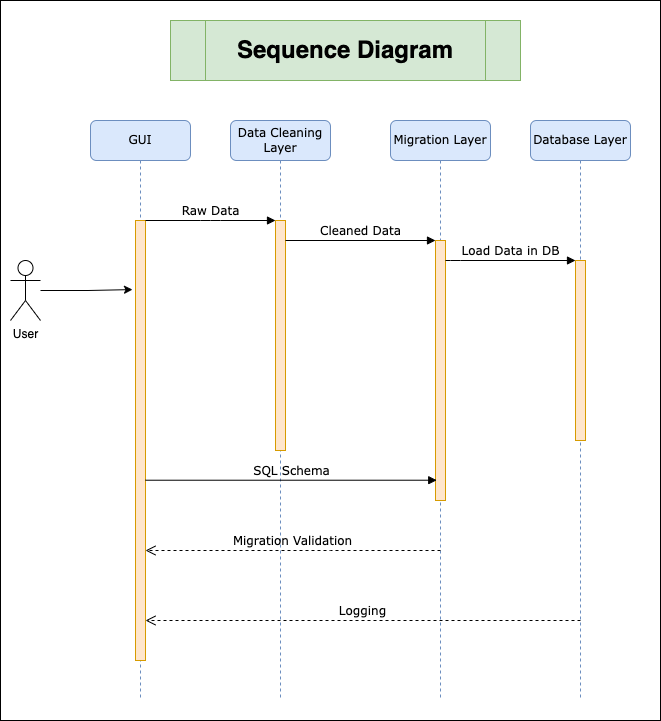

# Team Name: Gujjus

### Project: Histopathology Data Ingestion

### Data Area: Data Ingestion

## Overview

The goal of this project is to create an SQL schema from histopathology data provided in CSV and JSON formats, clean the data, and then migrate it into SQL tables. The project involves a combination of data analysis, database design, data cleaning, and data migration skills.

## Requirements

1. SQL schema generation: The project has to generate an SQL schema for the data provided in the CSV and JSON files. It will be static, meaning that the schema will not change as the data is updated.
2. Cleaning data: The project has to clean the data before it can be inserted into the database. This involves preparing the CSV or JSON files so that the data is consistent, accurate, and ready for insertion into the SQL database.
3. Validating data: The project has to validate the data before it can be inserted into the database. This involves checking for errors, missing values, duplicates, and inconsistencies in the data.
4. Migration of data: The project has to migrate the cleaned data into the SQL database. This involves inserting the data into the appropriate tables in the database, according to the SQL schema we created earlier.
5. Scalability: The system should be scalable to accommodate large volumes of data.
6. Error handling: The system should have mechanisms for handling and reporting errors that occur during data ingestion.
7. Logging: The system should have mechanisms for logging the process of data ingestion, including any errors that may have occurred.

## Non-Functional Requirements

1. Scalability: The system should be able to handle large volumes of data and scale horizontallv as the data volumes grow.
2. Performance: The system must be able to process and load data quickly and efficiently to minimize processing delays and ensure timely data delivery.
3. Usability: The system should be user-friendly and easy to use, with clear documentation and error messages to help users troubleshoot issues.
4. Security: We have implemented a security system to not let a sensitive data get compromised as per user requirements.

## Technical Requirements

1. SQL schema generation: The project is using MySQL as the database management system. The schema will include tables, columns, and relationships between the tables. The SQL schema should be designed to efficiently store and retrieve data, while also ensuring data integrity and consistency.
2. Cleaning data: The project is using Python as the programming language for cleaning the data. The project is using Pandas library for data manipulation and cleaning.
3. Data migration script: The project is using Python as the programming language for migrating the data into the SQL database. Migration is usefull for adding CSV or JSON data into a MySQL database.
4. Error handling: The project is using Python as the programming language for handling errors. Errors are handled while cleaning the data and migrating the data into the SQL database.

## System Design

<p align="center">

</p>

This flowchart is a graphical representation of a process that depicts the steps involved in completing a our project or task.

We have divided project into 3 phases.

1. SQL Schema Formation
2. Cleaning Data
3. Migration of data

<p align="center">

</p>

##### Stage 1 ( SQL Schema )

- The Data is provided in the form of CSV or JSON files.
- The first phase of our project is to create a SQL schema for the data.
- The schema will include tables, columns, and relationships between the tables.
- The SQL schema should be designed to efficiently store and retrieve data, while also ensuring data integrity and consistency.

##### Stage 2 ( Cleaning Data )

- The second phase of our project is to clean the data before it can be inserted into the database.
- This phase involves preparing the CSV or JSON files so that the data is consistent, accurate, and ready for insertion into the SQL database.
- During the cleaning process, we need to check for errors, missing values, duplicates, and inconsistencies in the data.

##### Stage 3 ( Migration of data )

- The third and final phase of our project is to migrate the cleaned data into the SQL database. This involves inserting the data into the appropriate tables in the database, according to the SQL schema we created earlier.
- The migration process can be done using SQL commands or a variety of tools and programming languages, such as Python or Java.
- Once the data migration script executed, we will log the process and any errors that may have occurred.

### Sequence Diagram

<p align="center">
    
</p>

---

## Generic Data Model

<p align="center">
    
</p>

Documentation: [Link](https://flaxen-mayonnaise-bdd.notion.site/Healthcare-Generic-Database-e6712ca6629045faa61c3a8fcf4adbd6)

---

## Folder Structure

The project is structured as follows:

- `config/`: Contain all configuration while migrating database scripts
- `images/`: Contain all images for README files
- `logs/`: Contain file for logs
- `migrations/`: Contain script for migrate tables
- `src/`: Contains all the source code for the project.
  - `data/`: Contain all data files for ingestion
  - `database/`: Contain file for database connection
  - `models/`: Contain sequalize models for tables
  - `sample_data/`: Contains sample data with data type
  - `scripts/`:
    - `CSV/`: Contain CSV to SQL migration script
    - `JSON/`: Contain JSON to SQL migration script
    - `clearTableData.js/`: script for clear all data from tables
  - `logger.js`: Logging Methods and Initialization
  - `index.js`: The entry point of the application.
- `.enc/`: Contains all global variable and private variables of project
- `package.json`: The project's package configuration file.

---

## How to run code?
Prerequisites:

- Node

For Linux:
```
curl -sL https://deb.nodesource.com/setup_13.x | sudo -E bash -
sudo apt-get install -y nodejs
```
For Mac:
```
brew install node
```
- SQL

Local Environment setup or MySQL

1. Clone the repository
2. Install dependencies

   ```bash
   npm install
   ```
3. Create `.env` file in root directory and add following variables

   ```bash
   DB_HOST = <ip address>
   DB_USER = <database user name>
   DB_PASSWORD = <password of database>
   DB_NAME = <db name>
   DB_PORT = <db port>
   ```

   sample `.env` file
   ```bash
   DB_HOST = localhost
   DB_USER = root
   DB_PASSWORD = root1234
   DB_NAME = histopathology
   DB_PORT = 3306
   ```
4. install sequelize-cli globally

   ```bash
   npm install -g sequelize-cli
   ```
5. Intialiize sequelize

   ```bash
   sequelize init
   ```

- configure config file.
- DB_NAME database should be present in the environment.
    - ```sql
        CREATE DATABASE IF NOT EXISTS <DB_NAME>;
        ```

6. Migration of tables

   ```bash
   sequelize db:migrate
   ```
7. Run Project

   ```bash
   npm start
   ```
8. Run Specific Script

   ```bash
   node src/scripts/CSV/csvToSql.js
   ```

   ```bash
   node src/scripts/JSON/jsonToSql.js
   ```

   ```bash
   node src/scripts/clearTableData.js
   ```
9. You can specify data file to ingest from `index.js` and their respective script files.

### Team Members

- Jay Ghevariya (2020101070)
- Tirth Motka (2020101036)
- Urvish Pujara (2020101032)
